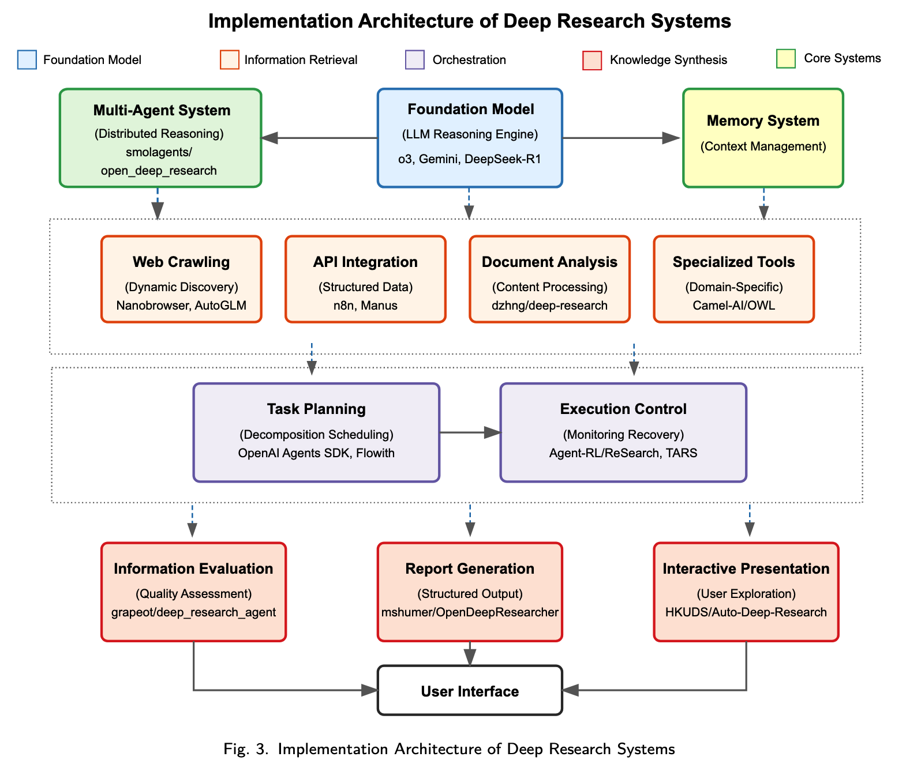
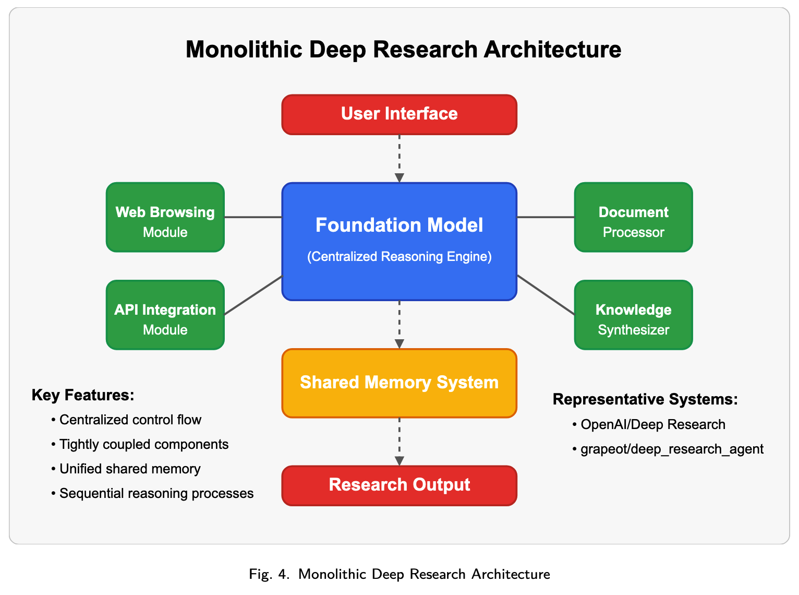
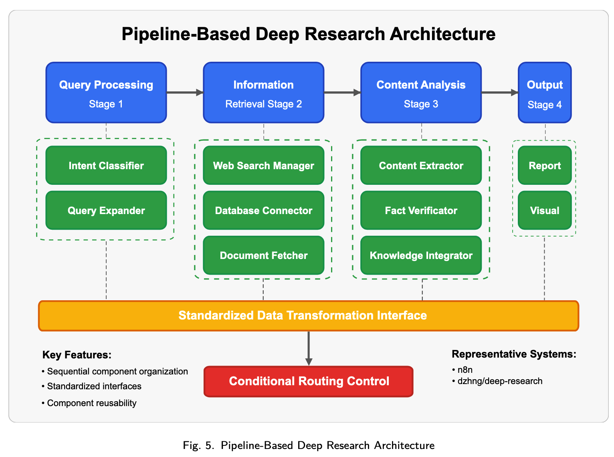
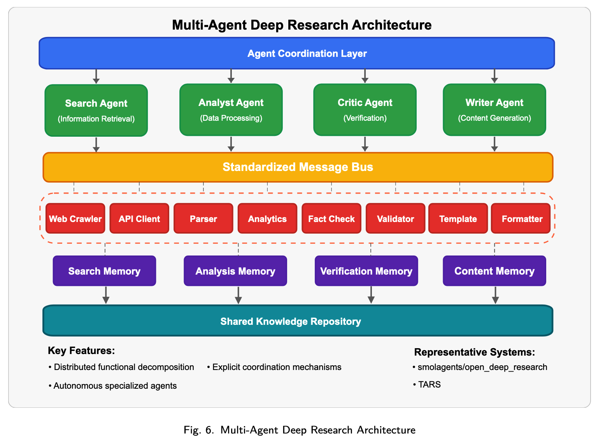
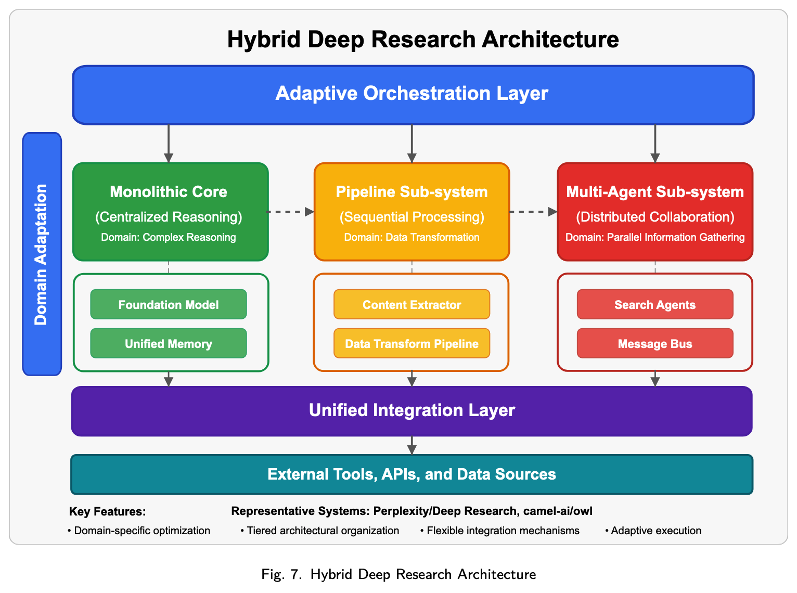
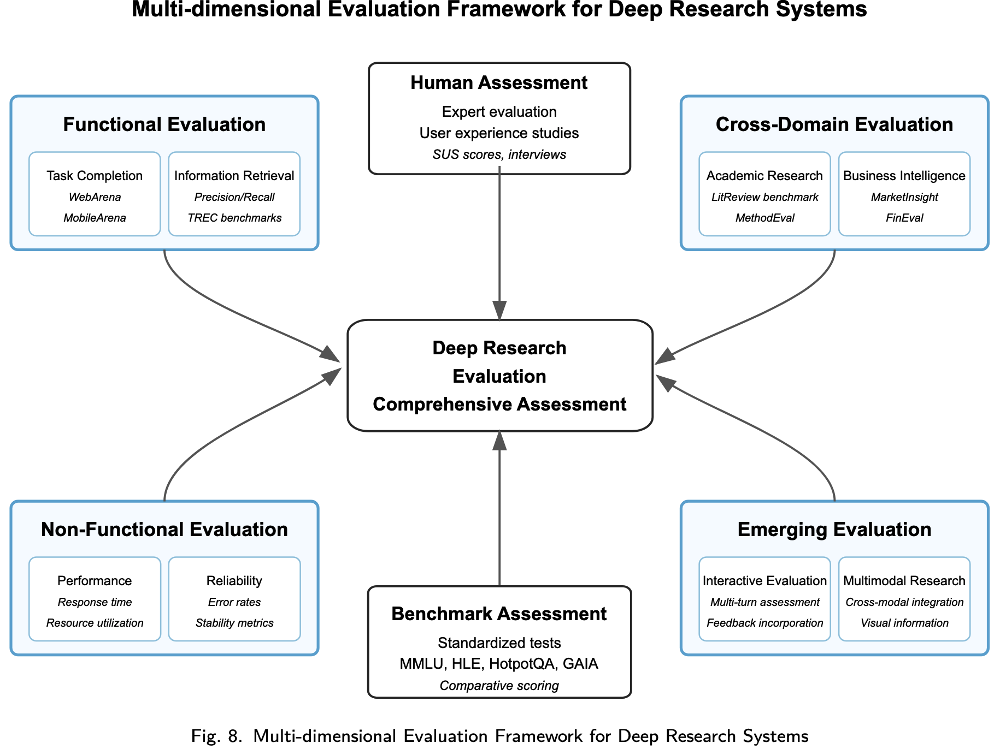
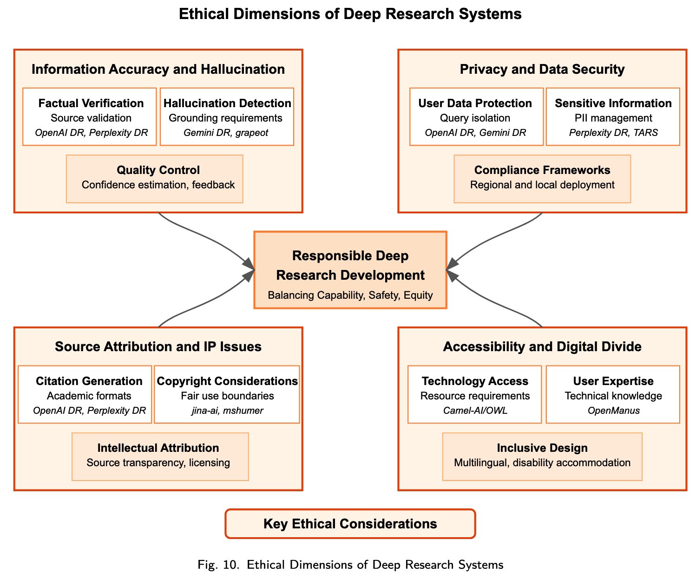
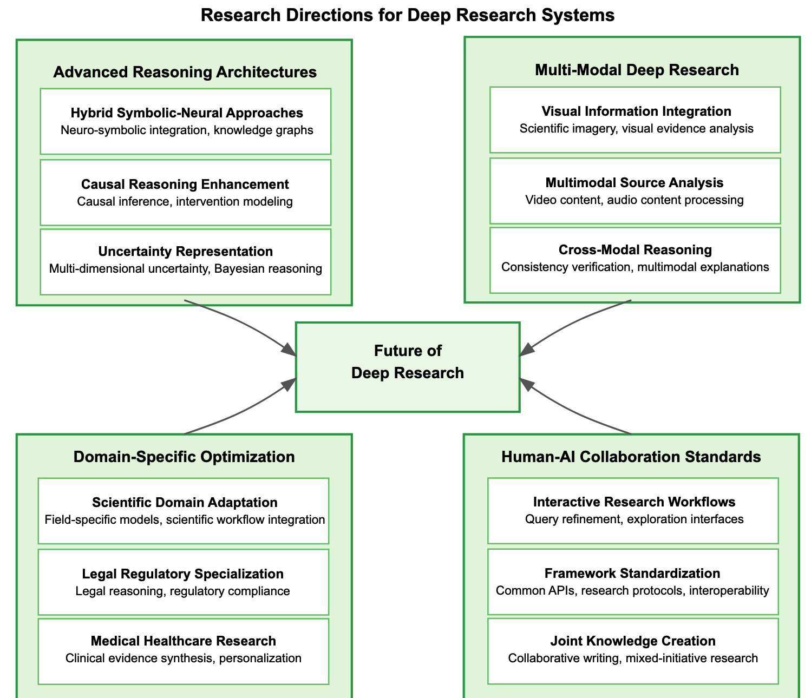
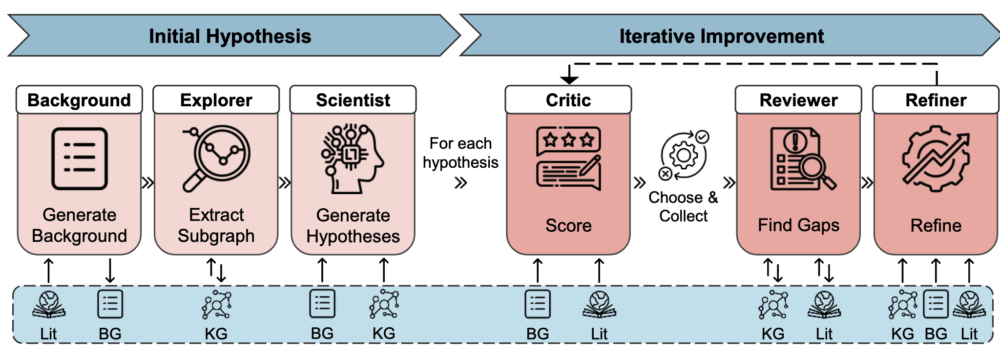

# A Comprehensive Survey of Deep Research: Systems, Methodologies, and Applications
## 阅读笔记

### 核心定义与范围

1. 定义：Deep Research是AI技术的系统性应用，通过三大核心维度实现研究流程自动化与增强：
	- 智能知识发现：自动化文献检索、假设生成及跨异质数据源的模式识别。
	- 端到端工作流自动化：将实验设计、数据收集、分析及结果解读整合为AI驱动的统一流程。
	- 协作智能增强：通过自然语言界面、可视化工具及动态知识表示，促进人机协作。

2. 与相邻AI系统的区别
	- 通用AI助手：如ChatGPT仅能回答研究问题，缺乏Deep Research系统的自主工作流、专业研究工具及端到端编排能力。
	- 单功能研究工具：如引文管理器、文献搜索引擎，仅解决孤立研究功能，无集成推理与跨功能编排能力。
	- 纯LLM应用：仅用研究导向提示包装LLM，缺乏环境交互、工具集成和工作流自动化能力。
### 发展历程与技术框架

1. 发展三阶段（2023-2025）

| 阶段         | 时间范围         | 关键事件                                                                                         |
| ---------- | ------------ | -------------------------------------------------------------------------------------------- |
| 起源与早期探索    | 2023-2025年2月 | 2024年12月Google Gemini推出首个Deep Research功能；依赖n8n、AutoGPT等早期工作流自动化工具                            |
| 技术突破与竞争    | 2025年2-3月    | DeepSeek开源模型推动市场；OpenAI、Perplexity相继发布Deep Research；大量开源项目涌现（如nickscamara/open-deepresearch） |
| 生态扩张与多模态融合 | 2025年3月-至今   | 开源项目支持本地化部署（如Jina-AI/node-DeepResearch）；商业系统新增多模态支持与多智能体协作；Anthropic推出Claude/Research        |

2. 四大技术维度框架
	1. 基础模型与推理引擎
		- 演进：从通用LLM（如GPT-4）转向研究专用模型（如OpenAI o3、Gemini 2.5 Pro），优化推理、上下文处理能力。
		- 关键能力：百万级token上下文窗口（如Gemini 2.5 Pro）、链式思维（Chain-of-Thought）与树式思维（Tree-of-Thought）推理、记忆管理（工作记忆与长期记忆分离）。
	2. 工具利用与环境交互
		- Web交互：从简单API搜索发展为动态内容处理、身份验证管理（如Nanobrowser
		- 内容处理：支持多模态内容（表格、PDF、可视化）提取与语义结构化（如dzhng/deep-research）。
		- 工具集成：通过ToolLLM等框架集成超16000个API，动态选择工具链（如Manus）。

	3. 任务规划与执行控制
		- 规划能力：从线性任务分解升级为分层规划，结合资源感知（如OpenAI/AgentsSDK）
		- 执行控制：支持并发执行、故障检测与自主恢复（如Agent-RL/ReSearch）。
		- 多智能体协作：分工明确的智能体角色、动态角色分配与冲突解决（如smolagents/open_deep_research）。

	4. 知识合成与输出生成
		- 信息评估：从依赖来源声誉转向多维度评估（来源特征、内容一致性、不确定性建模）
		- 报告生成：生成分层组织、证据整合的结构化报告（如mshumer/OpenDeepResearcher）。
		- 交互式呈现：支持结果钻取、来源验证（如HKUDS/Auto-Deep-Research）。

### 系统对比分析

1. 跨维度技术比较
	1. Foundation Model and Reasoning Efficiency Comparison
	2. Tool Integration and Environmental Adaptability Comparison
	3. Task Planning and Execution Stability Comparison
	4. Knowledge Synthesis and Output Quality Comparison
2. 应用场景适配性
	- 学术研究：OpenAI/DeepResearch、Camel-AI/OWL擅长文献综述、假设生成，支持学术数据库集成（如ArXiv、PubMed）。

	- 企业决策：Gemini/DeepResearch、Manus可分析市场趋势、生成战略建议，整合财务数据与行业报告。
	- 个人知识管理：Perplexity/DeepResearch（界面友好）、OpenManus（本地化部署）适合信息整理与个性化学习。

3. Performance Metrics and Benchmarking
	1. Quantitative Evaluation Metrics.
	2. Qualitative Assessment Frameworks.

### 实现技术与挑战

1. 四大架构模式
	1. 单体架构：集中控制、组件紧耦合（如OpenAI/DeepResearch）、共享内存架构，equential Reasoning Processes优势是推理连贯，劣势是扩展性差、难以并行。
	2. 流水线架构：Sequential Component Organization，分阶段处理、标准化接口，适合定制工作流、组件复用，但复杂推理能力弱、难以跨组件迭代求精。
	3. 多智能体架构：分布式功能、智能体协作（显式）、自主决策、动态分配，擅长复杂任务、可扩展性强、适于并行，但需协调成本。
	4. 混合架构：结合多种模式，分层的体系结构组织、特定领域的优化、灵活的集成机制、自适应执行框架；平衡灵活性与性能，但实现复杂。

2. 新兴的Agent框架系统
3. 比较
4. 基础设施
	1. 分布式推理架构：并行、记忆一致性和状态管理上的挑战
	2. 并行搜索与信息检索：并发查询执行、协作复杂
	3. 资源配置与效率优化：自适应分配、渐进式加工策略
5. 系统的集成和互操作性
	1. API设计与标准化
	2. 工具整合框架
	3. 跨平台兼容性
	4. 研究导向的编码辅助整合
6. 核心挑战
	1. 幻觉控制与事实一致性：存在幻觉问题，需通过多源验证、矛盾检测解决（如Perplexity的来源归因）。
	2. 隐私安全：需保证查询隔离、源数据保护、敏感信息脱敏（如OpenManus本地化部署）。
	3. 可解释性和透明性：推理路径、源归因与验证
### 评估

### 应用场景
学术研究 
科学发现 
商业智能
金融分析 
教育 
个人知识管理 
### 伦理及限制

### 未来研究方向

1. 先进推理架构：优化上下文压缩、融合符号-神经推理、增强因果推理与不确定性建模。

2. 多模态深度研究：加强科学图像分析、视频/音频内容处理、跨模态一致性验证。

3. 领域专用优化：针对科学、法律、医疗领域定制模型（如医疗的临床证据合成）。

4. 人机协作与标准化：开发交互式工作流、统一组件接口（如Anthropic MCP协议）、跨平台研究协议。

## 总结
1. 给出Deep Research的准确定义：深度研究( Deep Research )是指系统应用人工智能技术，通过3个核心维度实现研究过程的自动化和增强：
	1. 智能知识发现：实现跨异构数据源的文献检索、假设生成和模式识别的自动化；
	2. 端到端工作流自动化：将实验设计、数据收集、分析和结果解释集成到统一的人工智能驱动的管道中；
	3. 协同智能增强：通过自然语言接口、可视化和动态知识表示促进人-人工智能协作。
	4. 确定了其与类似AI系统的核心差异
2. 对比分析了现有框架在不同方面的能力
3. 并通过四种架构详细解释了其实现路径及优缺点，挑战及解决方案
4. 最后，探索了应用、限制、未来前景等方面内容

# 2025__BioDisco Multi-agent hypothesis generation with dual-mode evidence, iterative feedback and temporal evaluation

## 阅读笔记
### 摘要

1. 基于语言模型的推理能力和双模式证据系统（生物医学知识图谱与自动化文献检索）确保假设的新颖性有扎实依据，
2. 整合内部评分与反馈循环实现迭代优化，
3. 并通过开创性的时序评估、人工评估以及布拉德利-特里配对比较模型进行性能验证，从而提供有统计依据的评估结果。

- 相较于代表现有智能体架构的消融配置，BIODISCO在假设的新颖性和重要性方面表现更优
- BIODISCO设计具备灵活性与模块化特点，可无缝集成自定义语言模型或知识图谱
### 1 引言

- 问题：生物医学研究的推进依赖于大量新颖、可验证的假设。传统上假设的生成依赖于人类的直觉、领域专业知识以及人工文献综述，而科学数据和出版物的指数级增长正使这些方式面临越来越大的压力。
- 解决：这一挑战推动了自动化科学发现方法的发展，此类方法能够系统地挖掘并整合复杂的生物学关联。此外，对此类工具进行稳健评估也至关重要。
- 背景：
	- 知识图谱（KGs）为存储和分析科学知识提供了结构化基础--数据结构
		- 已有实现：但知识图谱的构建与维护既耗时又费力，
		- 且生物医学领域的大量知识仍存在于非结构化文本中，尚未被充分挖掘。
	- LLMs--现有方法
		- 能够从海量语料库中提取相关信息并识别潜在模式、具备更强的上下文推理能力
		- 可能会输出看似合理但缺乏事实依据的信息、可通过为模型配备外部接口，借助检索增强生成实现动态文献检索
	- 评价方法
		- 特殊：无真值
		- 通用策略：包括基于专家的评估、自动化语义相似性评分以及基于精选基准的验证
		- 基于模型的评估：比咨询人类专家更便捷，但对生成模型和评估模型各自的优势较为敏感，仅靠这种方式可能无法全面反映系统在真正科学发现方面的能力
- 相关研究：
	- 多智能体系统
		- 使用“专用智能体”，以模拟科学发现的迭代性和协作性特征：
			- 通常利用配备工具的大型语言模型，为不同智能体分配特定角色，从而模拟研究过程
		- 生物医学领域
			- 通用功能
			- 专注于特定领域
	- 评估指标：评估自动化假设生成系统的效能（尤其是大规模评估），不仅需要考量假设的连贯性，还需评估其新颖性、实验可行性和潜在影响力
		- 利用历史数据测试系统重新发现已知科学发现的能力：尚未得到充分应用
		- 尽管领域内人类专家的评估结果更为理想，但在大规模评估中难以保证评估的可靠性
		- LLM直接评分
		- 使用LLM进行配对比较的效果优于直接评分法：可能会引入额外偏差，如顺序效应。
		- Elo评分法进行自动化评估。但从统计学角度而言，更规范的做法是采用概率模型为评分提供不确定性估计，并支持模型诊断；而Elo系统（1978）无法实现这两点。
	- 基准测试
		- 自动化假设生成系统的定量评估正受到越来越多的关注。然而，这些基准测试大多侧重于评估知识检索、分类或数据驱动的见解提取能力，无法对我们系统所致力于生成的、新颖的多实体文本类假设进行评估。
- 贡献：
	- 该系统协调一系列专用智能体，通过协作构建、评估和优化生物医学假设，持续生成有证据支撑的见解，并推断出超出其显性知识库范围的可验证关联
	- 基于双模式证据的复杂自我评估循环
	- 提出BIODISCO
	- 对系统预测未发表科学关联的能力进行严格评估
		- 在两个包含“未来”发现的留存数据集上进行时序评估
		- 基于BradleyTerry模型（考虑平局和顺序效应）开展基于模型的消融研究
			- 消融研究：切除某些部分查看前后对比
		- 由两个生物医学领域的专家进行人工评估，并采用项目反应理论进行建模分析
	-  发布BIODISCO框架的开源Python软件包
### 2 多智能体假设生成器
1. 图1：自动化过程
2. 图2：架构
#### 双模式证据支撑
- 两种互补的证据来源：结构化知识图谱和通过PubMed API检索的实时学术文献
- 专用接口
- 知识图谱接口：支持从外部图谱中动态检索结构化生物医学知识
- 文献接口：支持智能体通过大型语言模型引导的、上下文感知的查询与检索流程，以编程方式获取生物医学文献。
#### 迭代优化与多智能体协作
- 整合了内部评论机制和（外部）双模式证据，旨在提升初始生成假设的质量和可信度
### 3 大型语言模型生成假设的评估
- 时序评估：旨在通过判断系统能否仅利用特定时间节点前的数据和文献，预测该时间节点后出现的发现，从而评估系统的真正发现能力
- 基于模型的消融研究：以量化智能体框架、工具和优化流程各组成部分的作用：Significantly, our evaluation incorporates **a pairwise LLM evaluator** combined **with a BradleyTerry model**.
	- 更稳定、更贴合人类判断地从多个维度评估假设质量，不仅能提供点估计，还能通过95%比较区间实现不确定性量化，相较于仅提供直接评分或单维度汇总的方法有显著进步。
- 人工评估：并采用贝叶斯多分类拉什模型对评估结果进行建模，以考虑可能存在的评估者特异性偏差和指标特异性偏差

#### BIODISCO能否预测未来假设？
数据集选择 --> 实验设置 --> 结果 

这表明BIODISCO生成的假设与人类筛选的真值假设的契合度显著高于随机水平

该分类器具有较高的精确率和召回率，表明BIODISCO生成的假设包含准确且可识别的关联信号

这些结果表明，在严格的时序约束下，BIODISCO仍能成功推断出新颖、语义相关且可验证的假设。
#### 知识与优化流程的作用是什么？

模型结果清晰显示，随着系统组件的不断增加，假设在新颖性和重要性方面的表现逐步提升。

其中，工具的使用带来的提升更为显著，这凸显了将生成过程建立在外部知识源基础上的重要价值。

值得注意的是，相关性和可验证性的表现模式不够明确：不同配置对的比较区间存在重叠，没有明显的最优者。例如，在主题相关性方面，单一大型语言模型甚至可能更受青睐。这可能是因为缺乏外部知识导致此类零样本系统的输出更贴近用户输入，但代价是牺牲了假设的新颖性和重要性。

#### 领域内人类专家如何评价？

定性反馈进一步证实了该系统在生成具有科学价值和上下文相关性假设方面的有效性。尽管有少量生成的假设存在新颖性不足或提出复杂且未经验证的关联等问题，但总体而言，专家一致认为这些假设在科学合理性和实验可操作性方面表现良好。

### 5 讨论和结论
本文提出了BIODISCO这一新颖的多智能体框架，用于生成有扎实依据且经过优化的生物医学假设，并已开放供研究使用。基于留存数据的时序评估表明，该系统能够超越其训练语料库进行推断；消融研究证实，迭代优化与外部知识的整合对生成“新颖”“重要”的假设具有协同增效作用，且效果优于各部分单独作用的总和；此外，通过人类专家评估以及采用概率心理测量模型处理偏差和不确定性，进一步验证了该系统的有效性。

#### 局限性

尽管假设在重要性和新颖性方面获得了较高评分，但这似乎是**以牺牲相关性和可验证性为代价**的。一种可能的解释是，**新颖性和可验证性之间存在固有的权衡关系：难以测试的内容往往更有可能尚未被研究**。此外，**单一的大型语言模型评估者可**能并非评估实验可行性的最佳选择，这一问题可通过**专门的假设测试框架**（如POPPER；Huang等人，2025a）进一步研究。遗憾的是，实验室中的实验验证超出了本文的研究范围。

同样，**假设与输入主题的“相关性”降低**，可能表明系统具备**广泛的探索能力和知识多样性**，也可能仅仅是Qi等人（2024）提出的**评估指标存在局限性**。

我们基于指标的评估仅依赖人类和大型语言模型对假设新颖性和重要性的**主观判断**。过度关注自我评估和优化可能会导致“古德哈特定律”效应，即**过度放大模型缺陷，夸大系统的实际应用价值**。

任何时序评估都存在一个核心问题：**其假设“可发现性”等同于“可预测性”**。然而，即使基于有缺陷的前提或最终被证伪，一个假设仍可能对某个领域做出有效且有价值的贡献。因此，**时序评估并非衡量系统质量的理想指标，一个优秀的系统应能生成新颖、合理的假设，而非仅仅生成与未来发现相符的假设**。

#### 未来研究方向

**对现有假设生成系统进行直接比较将是一项极具价值的研究工作**。但这面临一个重大障碍：**如何区分架构设计本身的影响与其他基础因素的影响**，例如数据和知识图谱的可获得性，以及智能体或评估过程中使用的不同大型语言模型的相对性能。与所有基于公开数据训练的大型语言模型评估一样，这一研究也可能面临**数据泄露**的问题（参见Zhou等人，2023）。

生物医学发现领域面临的一个主要开放性挑战是**如何整合多样化的多模态生物医学数据**，如临床记录、组学数据和医学影像数据。此外，还需进一步研究智能体系统的**可解释性**，通过追溯证据来源来阐明基于证据的推理过程，并更好地量化认知不确定性。

## 总结
提出BIODISCO，多智能体架构：双模式证据、迭代优化、时序评估；
新的评估方法：时序、消融（配对比较）、人工
# 2024_Cell_Empowering biomedical discovery with AI agents
借助人工智能智能体推动生物医学发现
## 阅读笔记
### 摘要
我们将“人工智能科学家”设想为**具备批判性学习与推理能力的系统**，这类系统通过整合人工智能模型、生物医学工具与实验平台的协作型智能体，为生物医学研究提供助力。生物医学人工智能智能体并非将人类排除在发现过程之外，而是**将人类的创造力与专业知识，同人工智能分析大型数据集、探索假设空间以及执行重复性任务的能力相结合**。人工智能智能体有望熟练完成各类任务，既能规划发现流程，也能进行自我评估，从而发现并弥补自身知识体系中的漏洞。这些智能体借助大型语言模型和生成模型构建结构化记忆以实现持续学习，并运用机器学习工具整合科学知识、生物学原理与理论。人工智能智能体的影响力可覆盖多个领域，从虚拟细胞模拟、表型的可编程控制、细胞电路设计，到新疗法的研发。
### 引言
- 人工智能智能体是具备反思性学习与推理能力的可对话系统，能够协调大型语言模型（LLMs）、机器学习（ML）工具、实验平台，甚至是这些要素的组合。
- **生物学**的复杂性要求我们采用灵活的方法，将复杂问题**分解**为可执行的任务。人工智能**智能体**能够把一个问题**拆解成多个易于处理的子任务**，随后由具备特定功能的智能体针对这些子任务开展定向解决，并整合科学知识。
- 在不久的将来，加快**发现流程**的速度，提高资源利用效率，从而推动发现流程的加速发展。
- 人工智能智能体不仅能提升常规任务的效率、实现重复性流程的自动化，还能通过分析大型数据集，以**超越当前人类驱动研究的规模和精度**探索**假设空间**。这种自动化使得持续、高通量的研究成为可能，而这是人类研究人员仅凭自身力量无法在相同规模或速度下实现的。
	- 展望未来，在获取特定时空尺度的实验测量数据之前，人工智能智能体能够跨时空尺度进行预测，从而获得传统机器学习单独无法实现的见解。最终，它们或许能帮助人类发现生物系统中全新的行为模式⁵。

- 这一愿景之所以能够实现，得益于大型语言模型⁶⁻⁸、多模态学习以及生成模型的发展--**背景**
	- LLM
		- 通过彼此间的对话以及与人类的对话实现协作
			- 可能会寻求人类的反馈与评价，并发现自身知识体系中的不足
			- 不同配置的智能体之间的对话，能够以模块化的方式整合这些能力
		- 被证明具备将复杂任务分解为子任务的能力
	- 问题：沿用LLM传统方法，可能无法研发出能够生成新颖假设的人工智能智能体
		- 因为这种新颖性并未存在于用于训练模型的数据中。这表明，当前的基础模型单独不足以支撑起人工智能科学家的研发。
		- 将大型语言模型作为对比来看，生成新颖假设需要**创造力以及以科学知识为基础**，而生成新颖文本则需要**遵循语义和语法规则**，因此后一种方式与大型语言模型内部的**next-token prediction**高度契合，前一种方式则可能并非如此。
- 在此，我们提出一种**观点**：人工智能科学家可通过人工智能智能体来实现，这些智能体**以人类、大型语言模型、机器学习模型以及实验平台等其他工具为支撑**，共同构成**复合人工智能系统**。
	- 一个人工智能智能体应能够提出生物医学假设、对其进行批判性评估、描述其不确定性，并以此为动力，以人类科学家可信赖的方式获取并完善其科学知识库¹⁷。
	- 人工智能智能体的设计应能适应新的生物学见解、整合最新的科学发现，并根据实验结果完善假设。这种**适应性**确保智能体在快速变化的生物学数据面前始终具有实用性¹⁶，在**整合新发现与保留旧知识**之间取得平衡¹⁸。
- 随着这一理念的转变，生物医学人工智能智能体的影响力可覆盖多个领域
- 生物医学人工智能智能体引发了伦理方面的思考
### 数据驱动模型在生物医学研究中的应用演进
在过去的几十年里，数据驱动模型通过开发数据库（DBs）、搜索引擎、机器学习以及交互式和基础学习模型（图2），重塑了生物医学研究
#### 数据库与搜索引擎
- 不足：
	- 搜索引擎但缺乏通过推理优化这些查询的能力
	- 无法对获取的信息进行迭代处理以优化结果，也不能定制后续操作。
	- 此外，尽管数据库通过经过筛选的数据降低了错误信息的风险，但缺乏识别和删除无关信息的机制。
- 与搜索引擎不同，人工智能智能体能够通过推理制定搜索查询，进而获取信息。经过筛选的数据库提供结构化且真实的信息，有助于降低智能体可能产生的幻觉式错误信息的相关风险
#### 机器学习模型
- 机器学习模型在识别模式、吸收隐性知识以对新数据进行泛化预测方面表现出色
- 通常需要为每项任务设计专门的模型，且不具备区分人工智能智能体的推理和交互能力
- 人工智能智能体是机器学习模型的演进
- 能够评估不断变化的环境，这对于建模动态生物系统具有重要价值
#### 交互式学习模型
- 通过整合探索机制和人类反馈，代表了机器学习模型的进一步发展
- 主动学习通过**选择能最大化模型性能的数据进行标记**，提高了训练效率。
- 然而，交互式模型主要针对特定应用场景设计，若不重新训练模型，难以泛化到新目标。
- 借助交互式学习，人工智能智能体在信息检索任务中获得了更高的自主性。但人工智能智能体超越了这种以数据为中心的方法
#### 人工智能智能体
智能体能够整合搜索引擎和机器学习工具，并通过感知模块处理多种数据模态的信息，从而基于科学证据生成并完善假设
### 生物医学人工智能智能体的类型
1. LLM-based AI agents
	1. 基本思路是：首先对大型语言模型进行**预训练**，使其编码**通用知识**；然后在**特定领域**内对其进行**微调**（指令微调），使其编码领域专属的**专业知识**；最后通过**角色扮演和对话**，使大型语言模型**与人类用户对齐**（基于人类反馈的强化学习（**RLHF**）通过从针对特定提示词的一系列响应中选择人类最偏好的输出，优化大型语言模型的性能，进一步使大型语言模型与人类角色对齐）
	2. 因此，对单个大型语言模型进行编程使其**承担多种角色**，相较于开发专用模型，是一种更实用、更有效的解决方案。我们设想了三种为生物人工智能智能体分配角色的方法：
		1. 特定领域微调
		2. 上下文学习：1，2都需要生物学家收集特定任务的数据或设计精确的提示词
		3. 智能体角色自动生成：然而，由于人类定义的角色并非总能如预期般引导智能体，目前越来越倾向于赋予基于大型语言模型的智能体在**角色定义方面更大的自主性**
	3. 由**单个**大型语言模型通过**提示词**承担**多种角色**构成的智能体系统，已被证明是科学研究中极具价值的支持工具。
2. Multi-agent AI systems单个智能体往往缺乏完成复杂任务所需的全面技能；下文将介绍五种多智能体系统的协作设计。
	1. Brainstorming agents：科学家与智能体凭借各自专业知识，共同开展协作会议以生成广泛研究概念的过程；使研究人员能够探索一系列全面的潜在研究方向。
	2. Expert consultation agents：从具备专业知识的个人或实体那里获取专业意见
	3. Research debate agents：两组智能体就某一研究主题提出对立观点，旨在说服对方团队的智能体（联想：GNN）
	4. Roundtable discussion agents：多个智能体通过交流不同观点，就讨论主题做出协作决策的过程
	5. Self-driving lab agents：在科学家的宏观指导下，端到端的发现流程会被迭代优化，无需人类进行逐步监督
### 人工智能智能体的自主级别
0-3级
2级“作为合作者的人工智能智能体”中，人工智能的作用进一步扩展，科学家与智能体共同完善假设。智能体承担假设测试的关键任务，运用更广泛的机器学习和实验工具进行科学发现⁷⁶。然而，它们理解科学现象和生成创新性假设的能力仍有限，**仅能在现有研究基础上进行线性拓展**。
3级“作为科学家的人工智能智能体”的过渡是一次重大飞跃
例子：遗传学，细胞生物学，化学生物学
### 构建人工智能智能体的路线图

与这些通常静态、需要手动更新和重新配置才能处理新任务或整合新工具的工作流程不同，人工智能智能体具有动态性，能够以个性化、符合用户需求和场景适配的方式运行；它们能够学习使用新工具，并根据科学家的具体指示和需求调整工作流程

此外，人工智能智能体对任务的自适应分配，有助于像人类研究人员一样自动整合新工具并重构现有流程

1. 感知模块：人工智能智能体可通过不同方式与环境交互。最直接的方式是使用自然语言，这是基于大型语言模型的智能体常见的感知模态。其他技术涉及多模态感知模块，智能体通过该模块处理来自环境的多模态数据流，或将多模态输入与基于文本的大型语言模型对齐。
	1. 对话模块
	2. 多模态感知模块：智能体将大型语言模型与其他数据类型对齐，以融合自然语言文本之外的多种数据模态。
		1. 对齐过程涉及两种主要策略：文本转换和表征对齐
		2. 除对齐之外，还可采用另一种方法：允许智能体接收以不同模态表示的输入
		3. 在生物医学数据上训练具有强大感知能力的智能体，需要大量高质量的多模态对齐数据对。然而，**收集此类数据仍面临挑战**。例如，多模态实验平台要么不存在，要么吞吐量较低；某些组织和细胞类型无法通过实验获取；许多疾病表型的样本量较小，导致数据收集难以实现
2. 交互模块：包括--支持与科学家沟通并遵循人类指令的人机交互模块；支持智能体间协作的多智能体交互模块；以及用于访问机器学习工具和实验平台的工具使用模块
	1. 人机交互模块
	2. 多智能体交互
	3. 工具使用
3. 记忆与学习模块
	1. 长期记忆模块：这种记忆既可以是内部的——通过学习过程编码在模型权重中，也可以是外部的——存储在辅助知识库中。内部记忆可直接用于完成零样本任务，而访问外部记忆则需要智能体执行操作，获取数据并将其整合到短期记忆中以供即时使用；更新知识库。
	2. 短期记忆模块：短期记忆通过上下文学习实现——相关信息作为上下文提示词整合到大型语言模型中；短期记忆可临时覆盖长期记忆，使智能体在模型权重范围内优先考虑近期信息而非旧知识
4. 推理模块
	1. 直接推理模块：智能体基于环境当前状态进行规划和推理，可采用不同的推理模式，如单路径推理（CoT）和多路径推理（树、图）
	2. 带反馈的推理：实验和人类反馈有助于人工智能智能体改进推理和规划过程；智能体的反馈机制还能实现对初始计划的自我评估
### 挑战
1. 稳健性与可靠性
2. 评估协议
3. 数据集生成
4. 人工智能智能体的治理
5. 风险与保障措施
6. 生物医学人工智能智能体特有的挑战
### 展望
1. 确保智能体行为符合场景和用户需求
2. 治理与负责任的人机合作

## 总结
分析了特定领域：生物医学上的AI Agent的发展、分类（其中包括多智能体系统的几种典型组织形式）、对其自主级别的分级（举例说明每一级在不同领域的作用），以及具体构建一个AI Agents系统所需的相关模块及现有技术。最后分析该领域的风险及未来展望。
